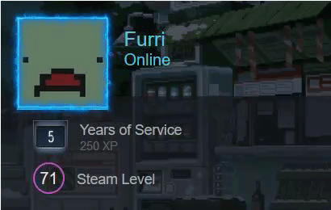
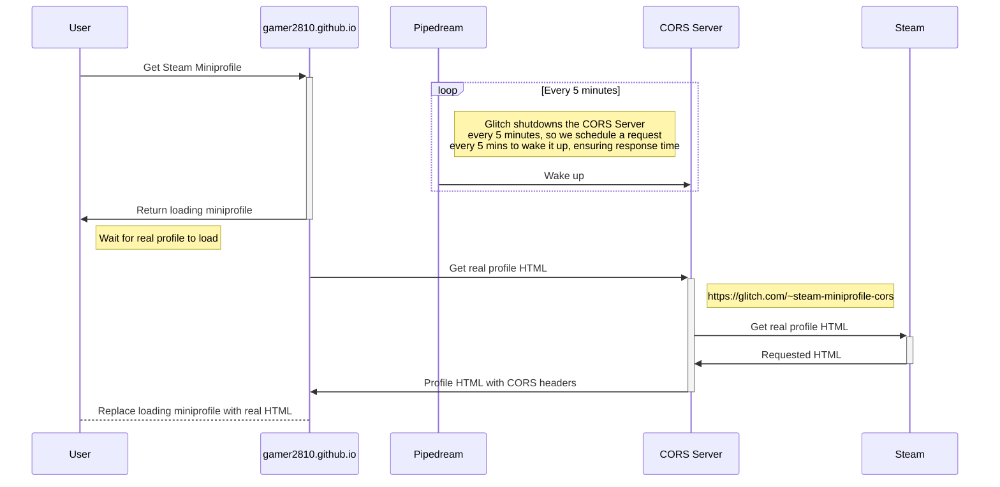

# A little tool to feature Steam's miniprofile on your website 

This is a tool that loads your miniprofile(*with animated background and frame*) as a HTML entity so that you can feature it on your website.  

Preview:  


## Guide

1. Get your Steam's **ID**, you can use any of these IDs from [SteamDB](https://steamdb.info/calculator/) or google how to find it yourself.


2. Replace *YOUR_ACCOUNTID_HERE* with the ID acquired from step 1
```html
 https://gamer2810.github.io/steam-miniprofile/?accountId=YOUR_ACCOUNTID_HERE
```
### Internationalization / Change Language
Add query parameter `lang` in your URL.
Example: https://gamer2810.github.io/steam-miniprofile/?lang=schinese

Available languages: `bulgarian,danish,english,french,greek,italian,koreana,polish,brazilian,russian,latam,swedish,tchinese,ukrainian,czech,dutch,finnish,german,hungarian,japanese,norwegian,portuguese,romanian,schinese,spanish,thai,turkish,vietnamese`


Examples: 
- https://gamer2810.github.io/steam-miniprofile/?accountId=238158335
- https://gamer2810.github.io/steam-miniprofile/?accountId=76561198198424063
- https://gamer2810.github.io/steam-miniprofile/?accountId=STEAM_1:1:119079167
- https://gamer2810.github.io/steam-miniprofile/?accountId=[U:1:238158335]

### To add this to your site
1.   You can load it into any div with JQuery or Javascript. [Jquery's Load() guide](https://www.tutorialspoint.com/How-to-load-external-HTML-into-a-div-using-jQuery).
2.  You can also load it as an _iframe_  
    >   `<iframe src="https://gamer2810.github.io/steam-miniprofile/?accountId=YOUR_ACCOUNTID_HERE" style="border:0px #ffffff none;" name="myiFrame" scrolling="no" frameborder="1" marginheight="0px" marginwidth="0px" height="400px" width="600px" allowfullscreen></iframe>`
-   Once it's loaded, you can mod it however you like using CSS.
-   A working example can be found at [My site](https://gamer2810.github.io/prologue/).

### How it works



#### Note
- This works by calling Steam's API and render the response with Steam's CSS. *This site is not affiliated with Steam or Valve*.
- Your profile will need to be public for this to work.
- ~~It will track your _public_ status (Online, Offline), but it *wont* track your _friend-only_ status (Away, Snooze,...)~~.
- You need to have your `Game Details` privacy settings set to `PUBLIC` if you want to show rich presence with `steam-miniprofile`.
- If your AccountID is invalid, it will instead load *MY* (as in the one writing this) miniprofile :).
- You might have to disable caching of the _iframe_ on your web, or changes on Steam won't be reflected immediately.

#### Contact
1. If you decide to use this tool, I'd love to see you show it off in [Discussion](https://github.com/gamer2810/steam-miniprofile/discussions/categories/show-and-tell).
2. If the tool does not work, please open an [Issue](https://github.com/gamer2810/steam-miniprofile/issues/new) and I will take a look.

*_Have a good day_*  and
<sub>~~Please feed me a star if you are feeling generous. I'm _humgry_~~</sub>
