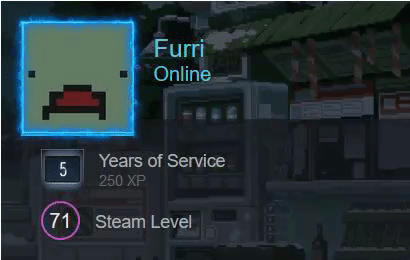

# A little tool to feature your Steam's miniprofile on your website 
This is a tool that loads your miniprofile(*with animated background and frame*) as a HTML entity so that you can feature it on your website.  
Preview:  

 <iframe src="gamer2810.github.io/steam-miniprofile" title="W3Schools Free Online Web Tutorials"></iframe> 

## Guide

1. Get your Steam's **AccountID**, you can use [SteamDB](https://steamdb.info/calculator/) or google how to find it yourself.
2. Access `https://gamer2810.github.io/steam-miniprofile/?accountId={YOUR_ACCOUNTID_HERE}`

### To add this to your site
1.   You can load it into any div with JQuery or Javascript. [Jquery's Load() guide](https://www.tutorialspoint.com/How-to-load-external-HTML-into-a-div-using-jQuery).
2.  You can also load it as an _iframe_  
    >   `<iframe src="https://gamer2810.github.io/steam-miniprofile/?accountId={YOUR_ACCOUNTID_HERE}" style="border:0px #ffffff none;" name="myiFrame" scrolling="no" frameborder="1" marginheight="0px" marginwidth="0px" height="400px" width="600px" allowfullscreen></iframe>`
-   Once it's loaded, you can mod it however you like using CSS.
-   A working example can be found at [My site](https://gamer2810.github.io/prologue/).

#### Note:
- This works by calling Steam's API and render the response with Steam's CSS. *This site is not affiliated with Steam or Valve*.
- Your profile will need to be public for this to work.
- It will track your _public_ status (Online, Offline), but it *wont* track your _friend-only_ status (Away, Snooze,...).  
- If your AccountID is invalid, it will instead load *MY* (as in the one writing this) miniprofile :).
- You might have to disable caching of the _iframe_ on your web, or changes on Steam won't be reflected immediately.

*_Have a good day_*  and
~~Please feed me a star if you are feeling generous. I'm _humgry_~~
